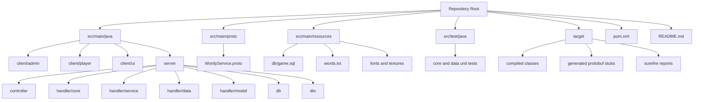
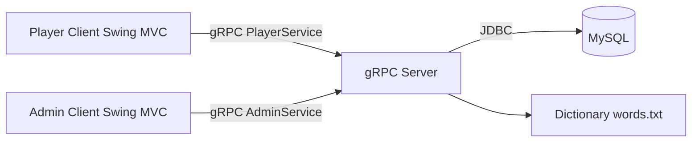
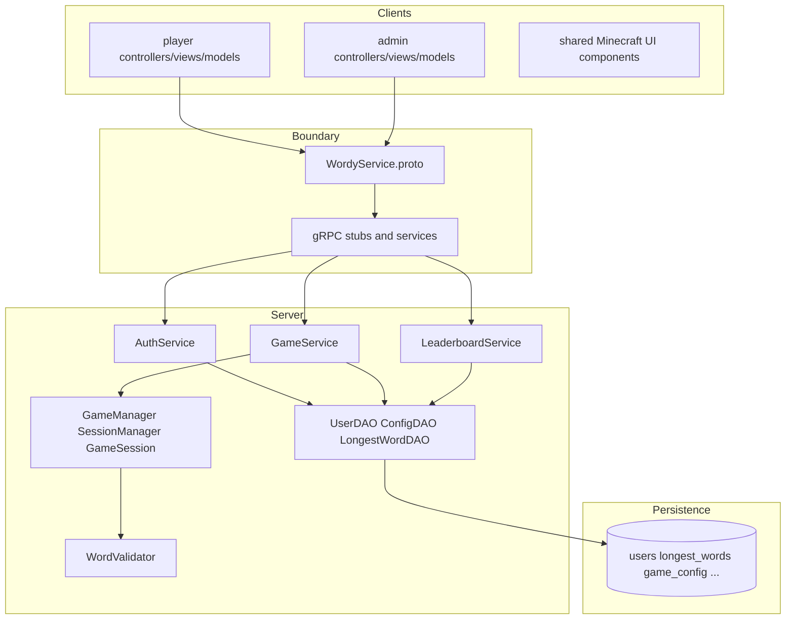
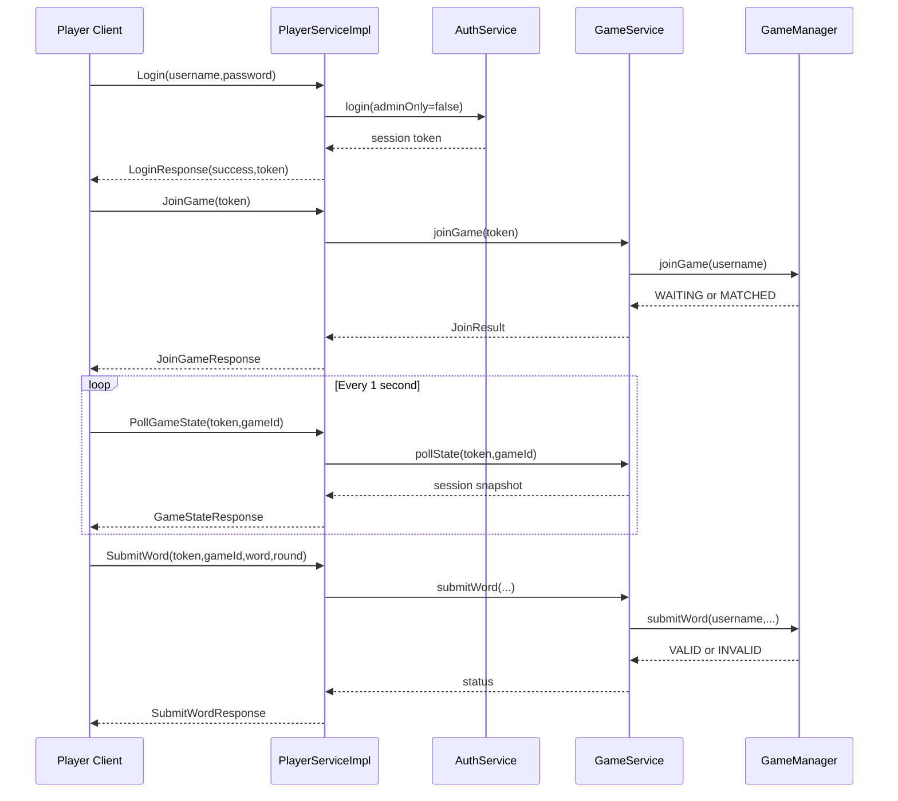
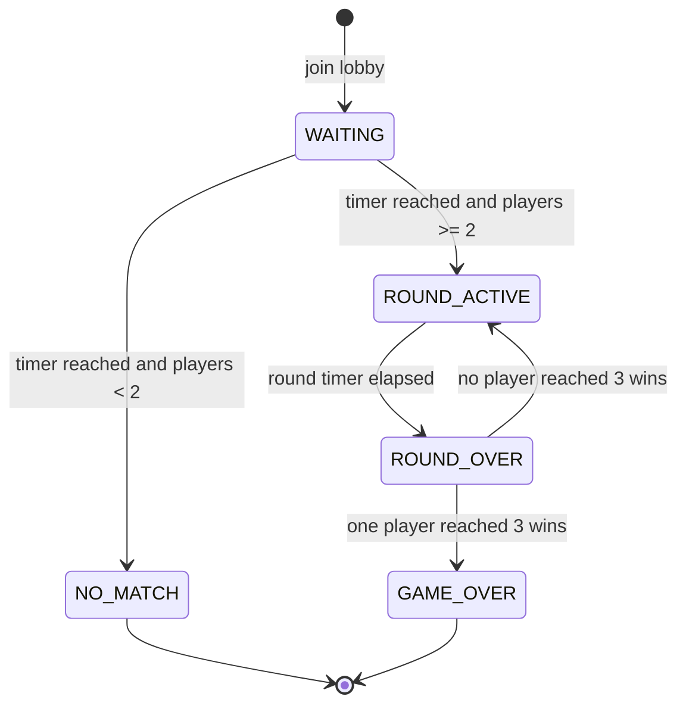
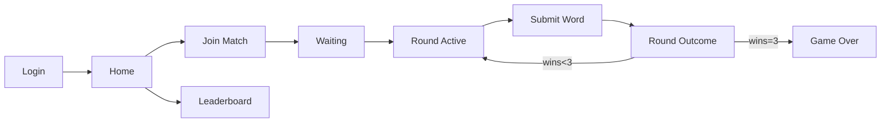
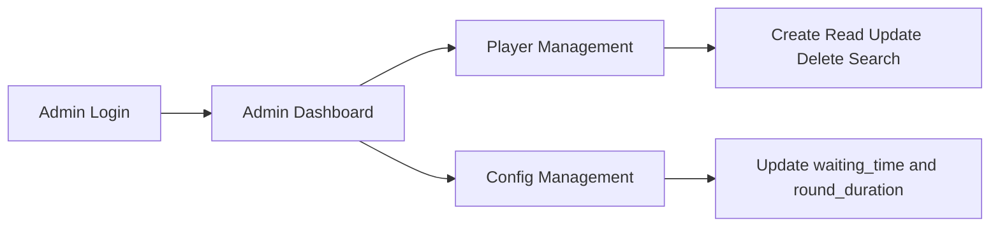
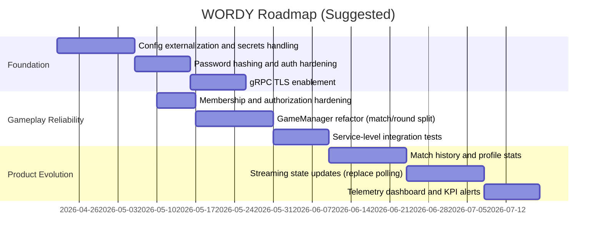
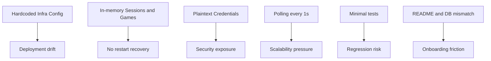
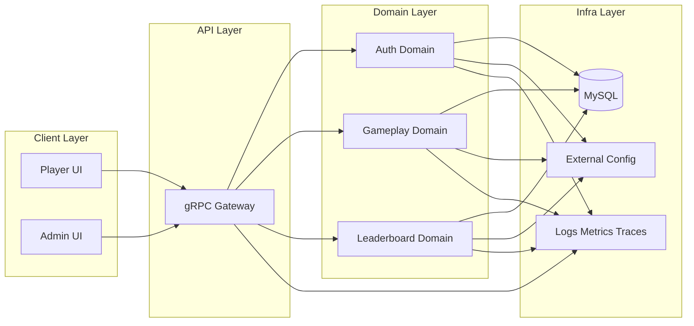

# WORDY Repository Deep Dive

Date: 2026-04-19
Repository: 9331-team4_finproject

## 1) Executive Summary

This repository implements a multiplayer word game called WORDY using:

- Java 17
- gRPC + Protocol Buffers for client/server communication
- Swing MVC clients for Player and Admin experiences
- JDBC + MySQL for persistence

From three viewpoints:

- Software architect: The project has a clear layered shape (client MVC -> gRPC boundary -> service/core/DAO) and solid domain logic separation, but also has scaling and security ceilings (in-memory runtime state, plaintext auth, no TLS, no config externalization).
- Software developer: The code is readable, organized by role and responsibility, and has useful helper abstractions (custom UI components, DAOs, service wrappers). Main gaps are testing breadth, error propagation depth, and maintainability around hardcoded constants.
- Product manager: The current product supports a strong MVP loop (login, matchmaking, rounds, winner, leaderboard, admin operations), but lacks account lifecycle depth, telemetry, and progression systems needed for long-term retention.

The codebase is practical and deliverable for small-group gameplay and coursework style deployment, and can be productionized with a focused hardening roadmap.

---

## 2) Scope And Method

This assessment covered the repository from multiple angles:

- Build and dependency setup: pom.xml
- Protocol boundary: src/main/proto/WordyService.proto
- Server runtime and orchestration:
  - src/main/java/server/GrpcServer.java
  - src/main/java/server/controller/*
  - src/main/java/server/handler/*
  - src/main/java/server/db/*
  - src/main/java/server/dto/*
- Player and Admin clients:
  - src/main/java/client/player/*
  - src/main/java/client/admin/*
  - src/main/java/client/ui/*
- Data schema and seed data:
  - src/main/resources/db/game.sql
- Validation assets:
  - src/main/resources/words.txt
- Tests:
  - src/test/java/server/handler/core/SessionManagerTest.java
  - src/test/java/server/handler/data/WordValidatorTest.java

Notes:

- The workspace contains target artifacts and generated sources; these are build outputs, not hand-authored source of truth.
- The current test run through tooling reported passing status for existing tests.

---

## 3) Repository Topology

### 3.1 Structural Map



### 3.2 Approximate Composition (source only)

- Java source files under src/main/java: 49
- Java test files under src/test/java: 2
- Proto files: 1
- Main resources: dictionary, SQL schema, font, textures

Interpretation:

- The project is code-heavy in runtime layers, light in test assets and operational config.

---

## 4) Software Architect View

## 4.1 Logical Architecture

### 4.1.1 System Context



### 4.1.2 Layer Decomposition



Architectural strengths:

- Clear separation between transport, business logic, and persistence.
- Good package-level organization by responsibility.
- Well-defined protocol contract in a single proto file.
- Centralized game orchestration in GameManager simplifies reasoning.

Architectural constraints:

- In-memory game/session state prevents horizontal scaling and state recovery on restart.
- Blocking clients with polling every second increase chatty traffic and latency perception.
- Hardcoded infrastructure values (port, DB URL, host) hinder deployment flexibility.

## 4.2 Runtime Architecture

### 4.2.1 Player Runtime Flow



### 4.2.2 Game Lifecycle State Machine



Key runtime observations:

- Lobby uses waiting_time from DB config.
- Round duration uses round_duration from DB config.
- Round winner selection is longest submitted word; ties produce no winner.
- Game winner threshold is hardcoded to 3 round wins.

## 4.3 Data Architecture

### 4.3.1 Entity Model

```mermaid
erDiagram
    USERS ||--o{ LONGEST_WORDS : submits
    USERS ||--o{ GAME_PARTICIPANTS : participates
    GAMES ||--o{ GAME_PARTICIPANTS : has
    USERS ||--o| GAMES : wins

    USERS {
        int user_id PK
        string username UNIQUE
        string password
        string role
        bool is_logged_in
        int total_wins
    }

    LONGEST_WORDS {
        int word_id PK
        int user_id FK
        string word
        int word_length
        datetime submitted_at
    }

    GAME_CONFIG {
        int config_id PK
        string config_key UNIQUE
        int config_value
        string description
    }

    GAMES {
        int game_id PK
        int winner_id FK
        datetime started_at
        datetime ended_at
    }

    GAME_PARTICIPANTS {
        int game_id PK_FK
        int user_id PK_FK
        int rounds_won
    }
```

Data implementation findings:

- users, longest_words, and game_config are actively used.
- games and game_participants are defined in SQL but currently unused in Java runtime.
- Game/session runtime truth lives in memory (GameSession maps), not in DB.

## 4.4 API Architecture

PlayerService RPCs:

- Login
- Logout
- JoinGame
- PollGameState
- SubmitWord
- GetLeaderboard

AdminService RPCs:

- AdminLogin
- CreatePlayer
- ReadPlayer
- UpdatePlayer
- DeletePlayer
- SearchPlayer
- GetConfig
- UpdateConfig

API quality notes:

- RPC boundaries are coherent and role-specific.
- Status handling uses string constants instead of enums, increasing typo risk.
- PollGameState exposes state snapshots suitable for thin clients.

## 4.5 Non-Functional Architecture Assessment

### Security

Current issues:

- Plaintext passwords in database and over application logic comparison.
- Plaintext gRPC channels (no TLS).
- Hardcoded database root user with empty password in DatabaseConnection.

Impact:

- Not production-safe for untrusted networks.

### Scalability

Current issues:

- Single-process in-memory state for sessions, lobby, and game instances.
- Polling model from each player every 1 second.

Impact:

- Works for small cohorts, degrades as concurrent users increase.

### Reliability

Current issues:

- Restart drops active sessions and game progress.
- DB failures during winner/word persistence are swallowed to keep loop alive.

Impact:

- Good resilience for gameplay continuity, but can introduce data drift.

### Observability

Current issues:

- Logging uses System.out/System.err only.
- No structured logs, metrics, traces, or audit stream.

Impact:

- Harder to diagnose production issues.

## 4.6 Architecture Risks And Recommendations

Priority 0 (must-fix before real deployment):

- Externalize config: DB URL, credentials, host, and ports.
- Add password hashing (BCrypt/Argon2).
- Enable TLS for gRPC.

Priority 1:

- Replace polling with server streaming for game state updates.
- Persist active games to durable store or add session recovery strategy.
- Add role and game-membership checks in all read paths.

Priority 2:

- Add observability stack (structured logging + key gameplay metrics).
- Introduce connection pooling and retries for JDBC layer.

---

## 5) Software Developer View

## 5.1 Package Responsibilities (Developer Mental Model)

| Package | Responsibility | Key Classes |
|---|---|---|
| client.player.controller | Player interaction orchestration | LoginController, HomeController, GameController, LeaderboardController |
| client.player.view | Player UI screens | LoginView, HomeView, GameView, LeaderboardView |
| client.player.model | Player gRPC gateway | PlayerGrpcClient |
| client.admin.controller | Admin interaction orchestration | AdminLoginController, AdminDashboardController, PlayerManagementController |
| client.admin.view | Admin UI screens | AdminLoginView, AdminDashboardView, PlayerManagementView |
| client.admin.model | Admin gRPC gateway | AdminGrpcClient |
| client.ui | Shared style constants | MinecraftColors, MinecraftFonts |
| client.ui.components | Reusable themed widgets | MinecraftButton, MinecraftPanel, LetterTile, etc. |
| server.controller | gRPC endpoint implementations | PlayerServiceImpl, AdminServiceImpl |
| server.handler.service | Application services | AuthService, GameService, LeaderboardService |
| server.handler.core | Stateful gameplay/session core | GameManager, GameSession, SessionManager |
| server.handler.data | Dictionary and word logic | WordValidator |
| server.db | Database access objects | UserDAO, ConfigDAO, LongestWordDAO |
| server.dto | DTO mapping objects | UserDTO, LongestWordDTO |

## 5.2 Code Quality Characteristics

What is done well:

- Naming is generally clear and intention-revealing.
- UI, service, and persistence concerns are not overly mixed.
- Data access is concentrated in DAO classes with prepared statements.
- Game loop and round transitions are easy to trace.

Where complexity currently lives:

- GameManager has multiple responsibilities: matchmaking, scheduling, result resolution, persistence side effects, lifecycle cleanup.
- GameController has significant UI + state machine coupling.

Refactoring opportunities:

- Extract MatchmakingCoordinator from GameManager.
- Extract RoundResolver from GameManager.
- Introduce typed result enums for submit and state statuses.
- Isolate polling/state sync concerns from GameController into a separate presenter/service class.

## 5.3 Concurrency And State Safety

Implemented patterns:

- ConcurrentHashMap for active indices.
- synchronized methods for SessionManager and GameSession mutation.
- ScheduledExecutorService for timed transitions (lobby promotion, round resolution).

Potential issues:

- Polling access path can fetch by gameId fallback without explicit membership re-check.
- Session and game state are process-local; cluster-safe semantics do not exist.
- Timers and state transitions depend on local JVM clock and scheduler behavior.

## 5.4 Build And Toolchain

Build design:

- protobuf-maven-plugin generates proto and grpc Java artifacts.
- build-helper-maven-plugin adds generated sources into compile path.
- surefire runs JUnit 5 tests.

Dependency highlights:

- grpc-netty-shaded, grpc-protobuf, grpc-stub
- mysql-connector-j
- junit-jupiter-api and engine

Build ergonomics:

- Simple single-module build is easy for contributors.
- Protoc plugin artifacts are currently pinned to Windows classifier, reducing cross-platform portability unless adjusted.

## 5.5 Test Posture

Current automated tests focus on:

- Session token invalidation semantics
- Dictionary case and letter-frequency checks

Major coverage gaps:

- No tests for GameManager round scheduling and winner logic under edge cases.
- No service-level tests for PlayerServiceImpl and AdminServiceImpl.
- No DAO integration tests against test DB.
- No UI tests for controller/view interactions.

Recommended test expansion order:

1. GameManager deterministic unit tests with controlled scheduler/test clock.
2. gRPC integration tests with in-process server.
3. DAO integration tests using isolated test schema or containerized MySQL.
4. Controller-level tests for login/logout/error transitions.

## 5.6 Important Inconsistencies

### README vs Source Reality

Detected mismatch:

- README references schema at src/main/java/server/db/game.sql and db.properties.
- Actual schema is at src/main/resources/db/game.sql.
- Database settings are hardcoded in DatabaseConnection.java.

### SQL vs Runtime Database Name

Detected mismatch:

- SQL creates/uses database wordy_game.
- JDBC URL points to database game.

Operational consequence:

- Fresh setup may fail unless database naming is manually reconciled.

---

## 6) Product Manager View

## 6.1 Product Definition

WORDY is a synchronous multiplayer word game with two product surfaces:

- Player app for gameplay and leaderboard participation.
- Admin app for account operations and game timing configuration.

## 6.2 User Personas

Primary personas:

- Casual Player: wants quick competitive rounds with simple controls.
- Competitive Player: wants leaderboard visibility and clear win feedback.
- Admin/Operator: wants user control and tunable pacing.

## 6.3 Current Feature Inventory

Player-facing features:

- Account login/logout
- Matchmaking wait flow
- Round gameplay with 20-letter board
- Word submission validation
- Round and game winner feedback
- Leaderboards (wins and longest words)

Admin-facing features:

- Admin-only login
- Player CRUD
- Player search
- Config update for waiting_time and round_duration

## 6.4 Core Journey Mapping



Admin journey:



## 6.5 Product Strengths

- Fast path to first game.
- Clear gameplay objective and short feedback loops.
- Distinct administrative control panel.
- Strong visual identity from Minecraft-styled UI components.

## 6.6 Product Gaps And Risks

Engagement gaps:

- No progression systems beyond total wins.
- No historical match summaries.
- No social or friend-based matchmaking.

Trust and fairness gaps:

- Limited anti-abuse controls.
- No explicit reconnection support mid-game.

Operational gaps:

- No telemetry for funnel conversion (login success, match found rate, drop-off).
- No A/B framework for tuning waiting_time and round_duration impact.

## 6.7 Suggested KPI Set

Acquisition and activation:

- Login success rate
- Time to first matched game
- Match found rate within waiting_time

Engagement:

- Games per active user per day
- Round completion rate
- Average word length submitted per round

Retention and satisfaction:

- Day-1 and Day-7 return rate
- Percent of games ending with winner vs repeated ties
- Leaderboard interaction frequency

Operations:

- RPC error rate by endpoint
- DB failure incidence in game resolution
- Mean poll latency and server response percentiles

## 6.8 Product Roadmap Proposal



---

## 7) Cross-Angle Findings Matrix

| Area | Current State | Risk Level | Recommendation |
|---|---|---|---|
| Authentication | Session tokens in memory, plaintext password compare | High | Hash passwords, add secure credential flow |
| Transport Security | Plaintext gRPC | High | Enable TLS and cert management |
| Runtime State | In-memory sessions and games | High | Add durable store or recovery strategy |
| Data Consistency | Winner/word persistence best-effort | Medium | Add retry and observable failure path |
| API Design | Role-separated RPCs, status strings | Medium | Move statuses to enums, standardize errors |
| Testing | Minimal unit coverage | High | Expand core/service/DAO/integration tests |
| Configurability | Mostly hardcoded values | High | Environment/property-based configuration |
| Product Analytics | No telemetry instrumentation | Medium | Add event and operational metrics |
| UX | Distinct branded UI and clear flows | Low | Preserve style while improving feedback detail |

---

## 8) Prioritized Action Backlog

## Phase 1 (Immediate)

- Fix README setup instructions to match actual paths and configuration behavior.
- Reconcile DB naming mismatch (wordy_game vs game).
- Remove hardcoded DB credentials and inject from environment/properties.
- Implement password hashing migration.

## Phase 2 (Short-Term)

- Add membership guard in state polling fallback path.
- Introduce structured logging with request/game/session context IDs.
- Expand test coverage around GameManager and gRPC service behaviors.

## Phase 3 (Mid-Term)

- Replace polling with server-streaming game state updates.
- Persist match-level history in games and game_participants tables.
- Add analytics events and operational dashboards.

---

## 9) Technical Appendix

## 9.1 Constants And Defaults (Observed)

- gRPC server port: 6767
- Client host/port: localhost:6767
- Default waiting_time: 10 seconds
- Default round_duration: 30 seconds
- Win threshold: 3 rounds
- Letter board size: 20 letters
- Minimum word length: 5
- Dictionary file: words.txt (loaded at startup)

## 9.2 Runtime Risk Hotspots



## 9.3 Suggested Target Architecture (Next Iteration)



---

## 10) Final Assessment

This repository shows a strong educational-to-practical architecture baseline with clear domain boundaries, a complete MVP gameplay loop, and thoughtful UI consistency. It is especially strong in readability and end-to-end feature completeness for a single-server deployment model.

To move from robust prototype to production-ready service, the most important upgrades are security hardening, externalized configuration, broader automated testing, and scalable state/event handling.

If those priorities are executed in sequence, WORDY can evolve from a solid course project architecture into a maintainable multiplayer game platform foundation.
